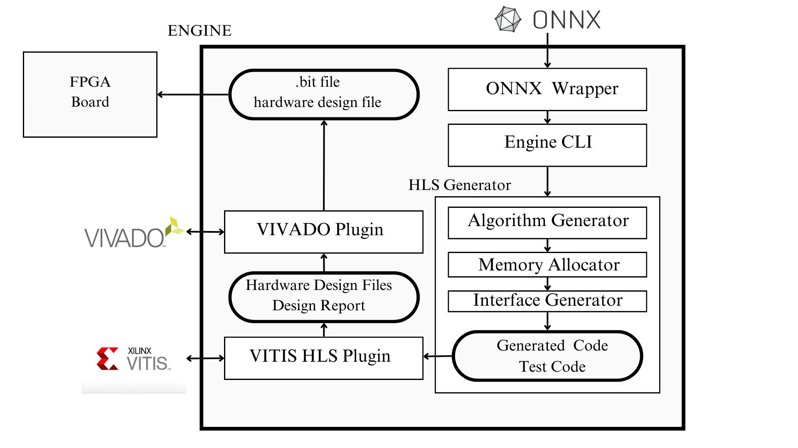

# Summary
Deep learning (DL) has revolutionized diverse fields, but the computational demands of DL models present challenges for real-time inference and training. Field-programmable gate arrays (FPGAs) offer a solution due to their flexibility, yet designing for FPGAs is complex. We introduce a novel software framework converting ONNX models to FPGA implementations, optimized for on-chip inference and training. Leveraging ONNX's interoperability, our framework seamlessly integrates DL models with FPGA hardware, supporting various architectures. This advancement represents a comprehensive approach, addressing both inference and training, enabling DL practitioners to leverage FPGA hardware effectively.


# Statement of Need

Designing an FPGA with VHDL or HLS presents significant challenges due to the complexity of both the languages and the hardware. It requires a deep understanding of digital logic and FPGA architectures, making it challenging to translate high-level design concepts into efficient architecture. Optimizing performance and minimizing power consumption involves intricate trade-offs between design complexity and resource utilization. 

Debugging FPGA designs also can be challenging, as traditional software debugging techniques may not apply directly to hardware designs. Additionally, FPGA development requires a steep learning curve, demanding time and effort to acquire proficiency in designing FPGA architecture. Overall, designing hardware on FPGA requires expertise, patience, and a systematic approach to overcome these challenges.

In the realm of FPGA-based deep learning engines, most tools[source:1] [source:2] rely on LLVM IR representation for optimization, limiting hardware-specific optimizations. However, our tool takes a different route, focusing on a software-driven approach to hardware design. This unique perspective makes it easier to implement future optimizations tailored to deep learning architectures. Additionally, our engine stands out by supporting on-chip training for deep learning models, expanding its capabilities beyond conventional inference tasks. This approach not only promises improved performance but also opens doors for advancing FPGA-based deep learning systems.

In response to the growing demand within academic and industrial circles, there is a clear need for a simplified method for deploying DL models on FPGAs. This need is increasingly evident when surveying[source:3] the existing literature and observing the challenges faced by researchers and practitioners alike in effectively utilizing FPGA-accelerated DL solutions.

# Supported Features
Our engine provides support for essential DL operations such as feedforward processing and convolution. Feedforward operations enable the flow of data through neural network layers from input to output, facilitating tasks like classification and regression. Convolution operations, on the other hand, are fundamental for tasks involving spatial relationships, such as image processing and feature extraction. With our support for these operations, users can efficiently implement a wide range of deep learning models and applications, empowering them to address complex tasks effectively.

Our engine supports DMA (Direct Memory Access) usage for efficient data (image stream) transfer and BRAM (Block RAM) usage for storing weights and parameters of the model. DMA usage enables data transfer  between different memory locations, which is vital for accelerating data-intensive tasks. Meanwhile, BRAM usage ensures efficient utilization of on-chip memory resources, reducing access latency and improving overall performance. By leveraging DMA and BRAM usage, our engine optimizes resource utilization, maximizing hardware efficiency and facilitating faster and more efficient execution of deep learning tasks on FPGA platforms.

# Example Usage with Pytorch 
```python
import torch
import torch.nn as nn
import torch.nn.functional as F

class MyModel(nn.Module):

    def __init__(self):
        super(MyModel, self).__init__()
        self.conv1 = nn.Conv2d(1, 2, 3)
        self.fc1 = nn.Linear(30*30*2, 120)
        self.fc2 = nn.Linear(120, 84)
        self.fc3 = nn.Linear(84, 10)

    def forward(self, x):
        x = F.relu(self.conv1(x))
        x = torch.flatten(x, 1)
        x = F.relu(self.fc1(x))
        x = F.relu(self.fc2(x))
        x = self.fc3(x)
        return x

torch_model = MyModel()
torch_input = torch.randn(1, 1, 32, 32)
onnx_program = torch.onnx.dynamo_export(torch_model, torch_input)
onnx_program.save("my_image_classifier.onnx")
```

```console
python3 main.py --onnx-file-name my_image_classifier.onnx --precision float64  --dma-usage True
```

# Test Setup and Results
The testing feature in the fpgai engine allows users to configure and customize their testing models according to their specific requirements. User can use our examples and define test model in test/test_model.py file with any framework. The engine will use this model to compare network outputs with compiled HLS implementation.

The output report generated by the HLS compiler will be parsed and presented to the user, providing visibility into the hardware components utilized by the engine. This feature enables users to understand the resource consumption of the engine, empowering them to make informed decisions regarding hardware allocation and optimization strategies.

# Modular Usage and Optimization Configuration

```python
from fpgai_engine import fpgai_engine

    fpgai_engine_object = fpgai_engine(onnx_file_name="my_onnx_file.onnx", precision = "float64",vitis_hls_location="/tools/Xilinx/Vitis_HLS/2023.2", hls_project_name= "trial_project", hls_solution_name= "solution1",memory_option_weights="BRAM" , use_DMA=True,user_DDR=True)
    fpgai_engine_object.generate_hls_file(mode="inference",file_location= "/home/desktop/my_hls_project")
    fpgai_engine_object.generate_hls_file(mode="training",file_location= "/home/desktop/my_hls_project")

    results = fpgai_engine_object.compile_hls_file(file_location= "/home/desktop/my_hardware_project")
    print(results)
    fpgai_engine_object.compile_hardware_files(file_location= "/home/desktop/my_hardware_project")

    
```


# Future work

Our current engine supports basic architectures like feedforward and convolutional layers. Moving forward, we plan to include more complex models such as recurrent neural networks (RNNs). Additionally, our design is flexible enough to easily integrate new hardware optimization techniques. This adaptability ensures our engine remains at the forefront of FPGA-accelerated deep learning advancements in academia and industry.

# How to cite

If you are using fpgai for your work, please cite this paper.

# Acknowledgments

* This work is supported by the project Dutch Brain Interface Initiative (DBI2) with project number 024.005.022 of the research programme Gravitation which is (partly) financed by the Dutch Research Council (NWO).

# References
