# FPGAI plot gallery

## figure_00_plot_status

Artifact-status overview showing which paper figures are generated and which require real board-runtime measurements.

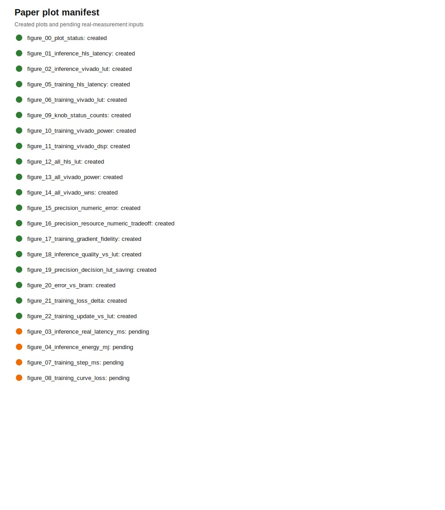

## figure_01_inference_hls_latency

Inference HLS latency across the frozen inference subset, generated from Vitis HLS synthesis reports.

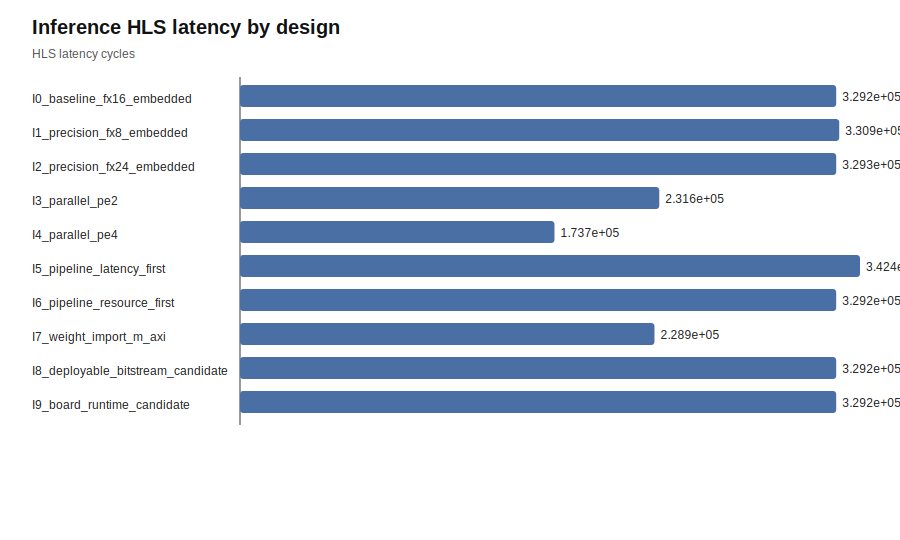

## figure_02_inference_vivado_lut

Implemented inference LUT usage across the frozen inference subset, generated from Vivado implementation reports.

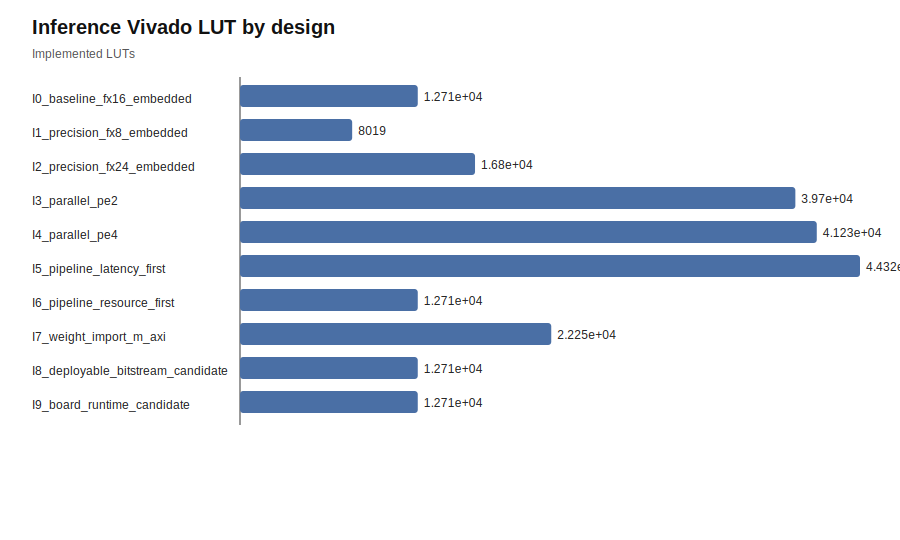

## figure_05_training_hls_latency

Training HLS latency across the frozen training subset, generated from Vitis HLS synthesis reports.

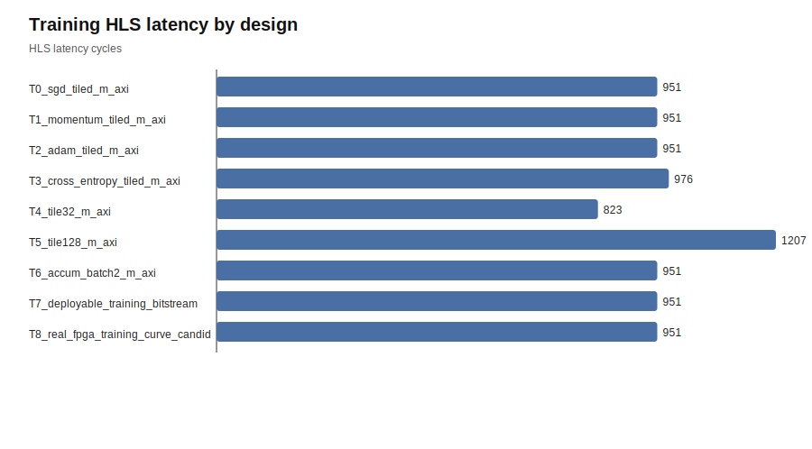

## figure_06_training_vivado_lut

Implemented training LUT usage across the frozen training subset, generated from Vivado implementation reports.

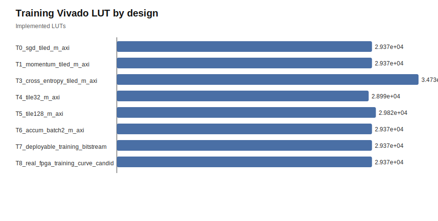

## figure_09_knob_status_counts

Coverage of YAML/hardware knob application status across generated hardware knob contracts.

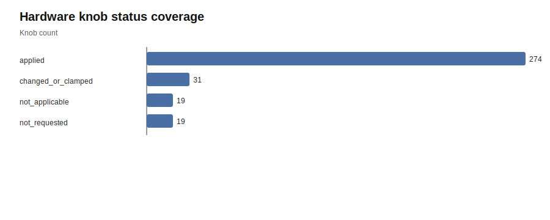

## figure_10_training_vivado_power

Implemented training design power reported by Vivado for the frozen training subset.

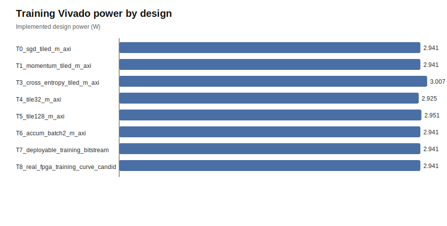

## figure_11_training_vivado_dsp

Implemented training DSP usage reported by Vivado for the frozen training subset.

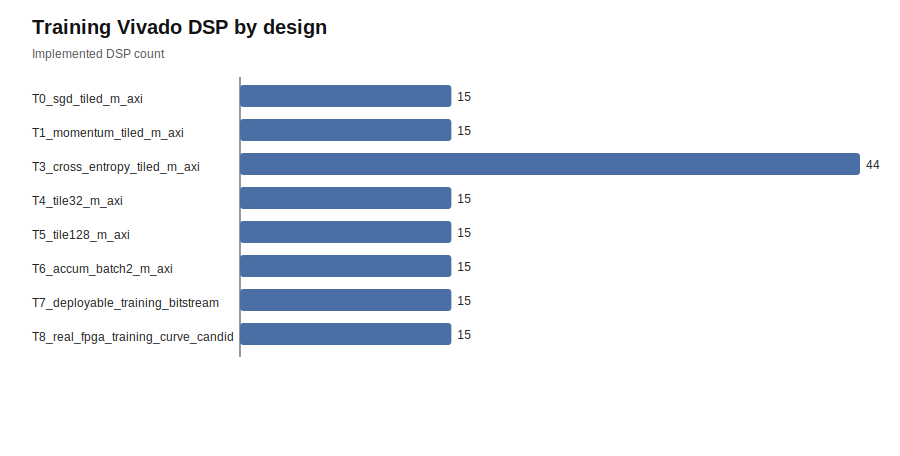

## figure_12_all_hls_lut

HLS LUT comparison across all frozen paper designs with HLS reports.

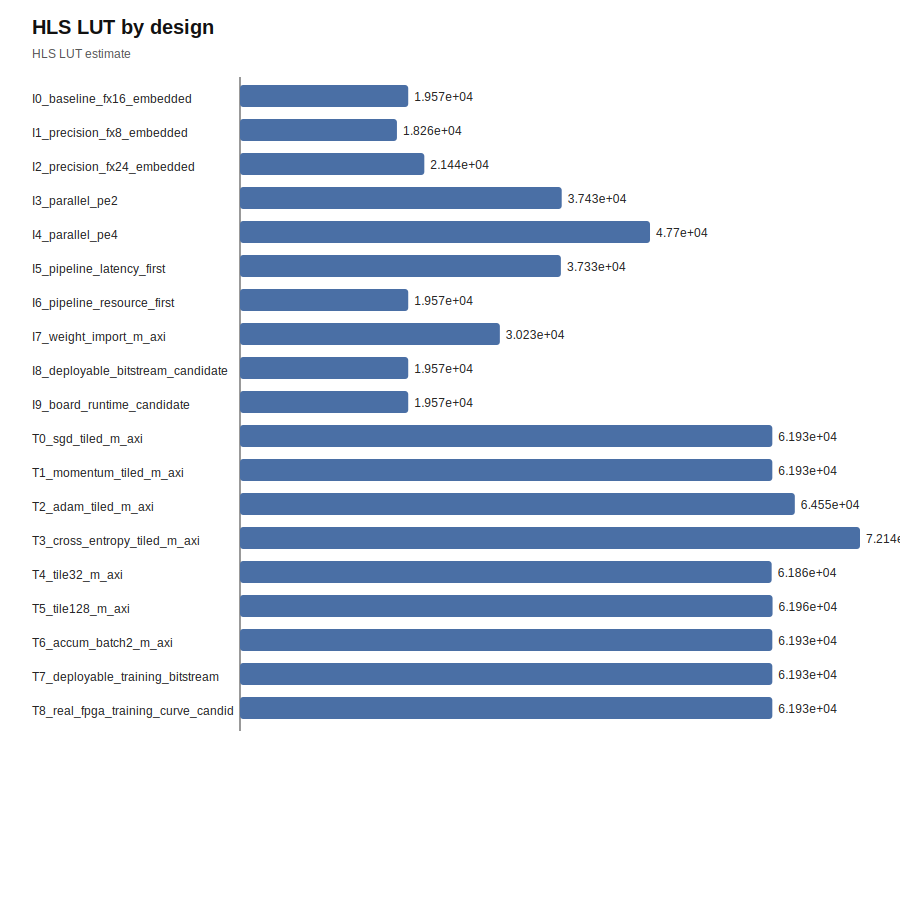

## figure_13_all_vivado_power

Vivado power comparison across all frozen paper designs with implementation reports.

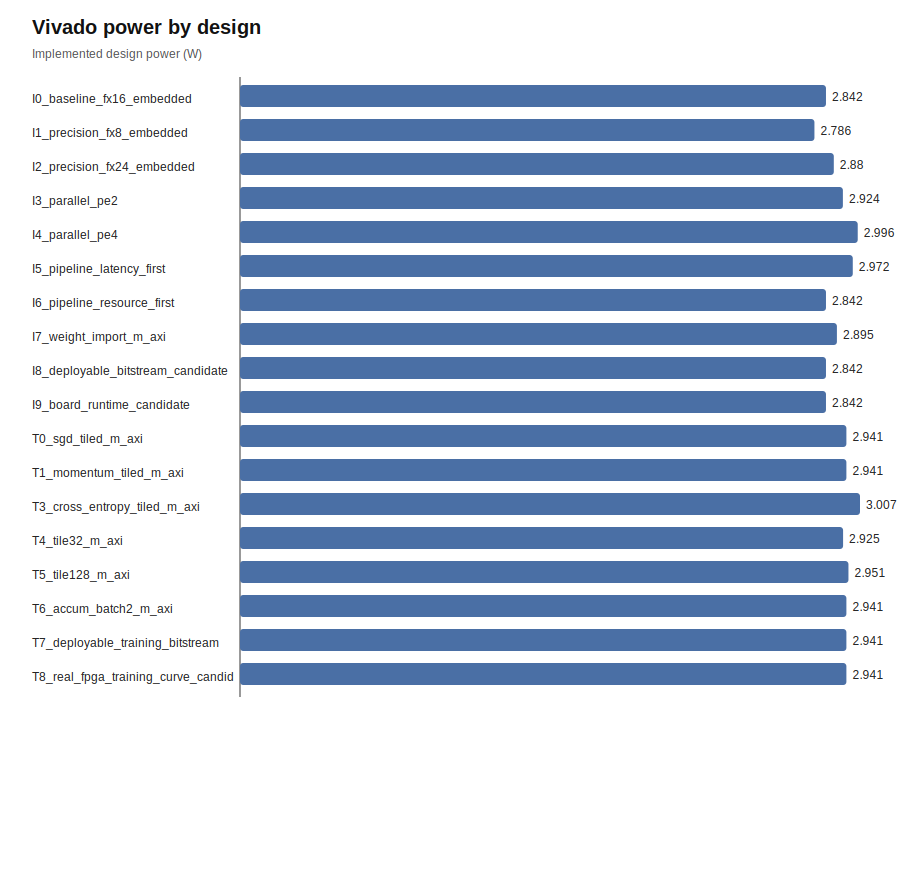

## figure_14_all_vivado_wns

Vivado timing slack comparison across all frozen paper designs with implementation reports.

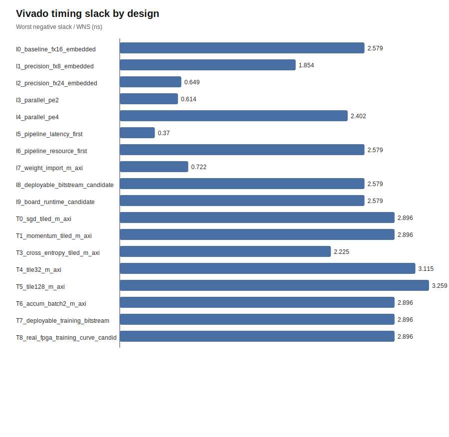

## figure_15_precision_numeric_error

Inference precision numeric error against the Python/ONNX reference for precision-focused rows, generated only when reference-output comparison artifacts are available.

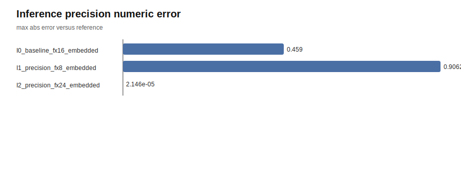

## figure_16_precision_resource_numeric_tradeoff

Precision tradeoff between reference-output error and implemented LUT cost, generated from numeric-validation and Vivado artifacts.

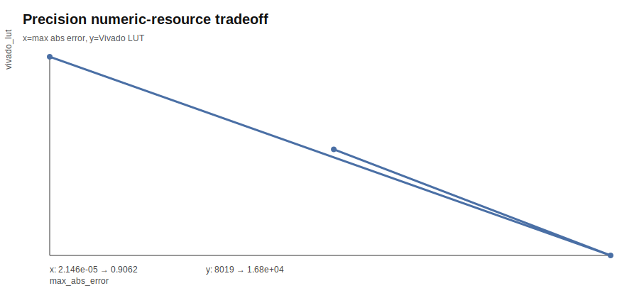

## figure_17_training_gradient_fidelity

Training gradient fidelity against the Python reference across on-device-training rows, generated from numeric-validation artifacts.

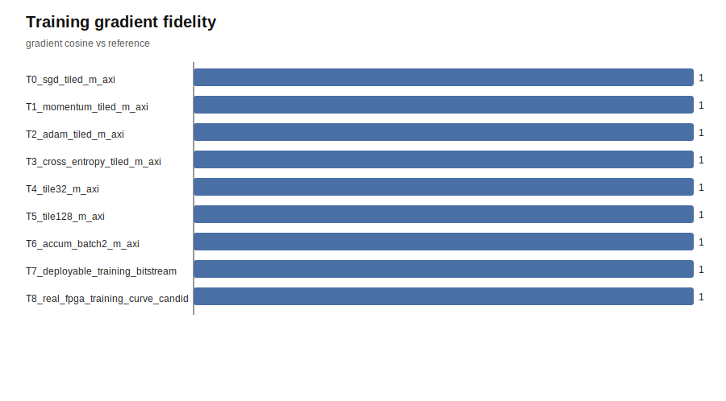

## figure_18_inference_quality_vs_lut

Inference task-quality/resource decision plot. When labels are available, quality can be task accuracy; otherwise it uses generated-vs-reference prediction agreement.

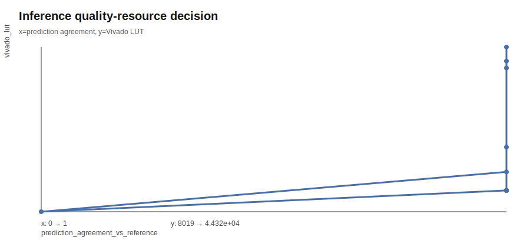

## figure_19_precision_decision_lut_saving

Precision decision plot showing implemented LUT saving versus the fx16 baseline for precision-focused rows.

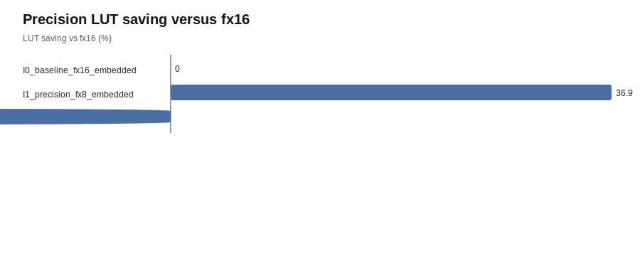

## figure_20_error_vs_bram

Precision decision plot showing output error versus implemented BRAM usage.

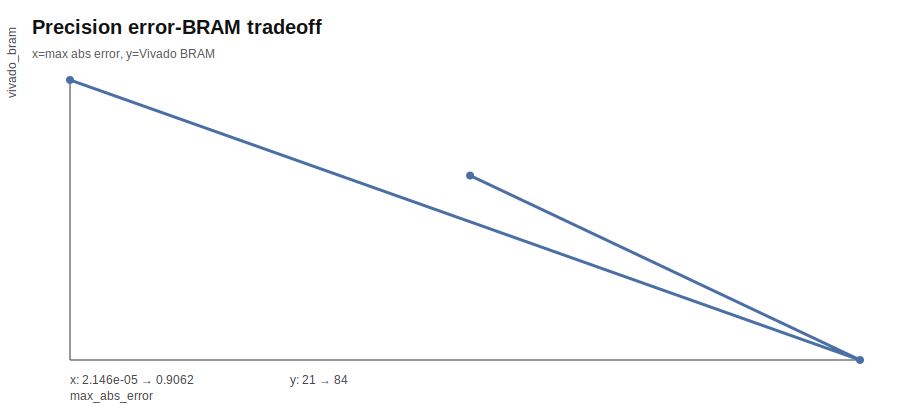

## figure_21_training_loss_delta

Training decision plot showing loss change over the available reference/testbench training step artifacts.

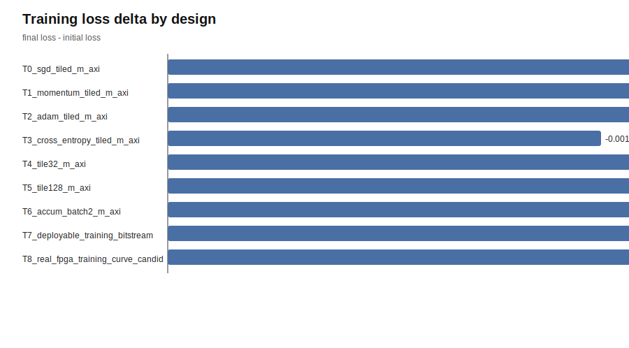

## figure_22_training_update_vs_lut

Training decision plot showing update-direction fidelity against implemented LUT cost.

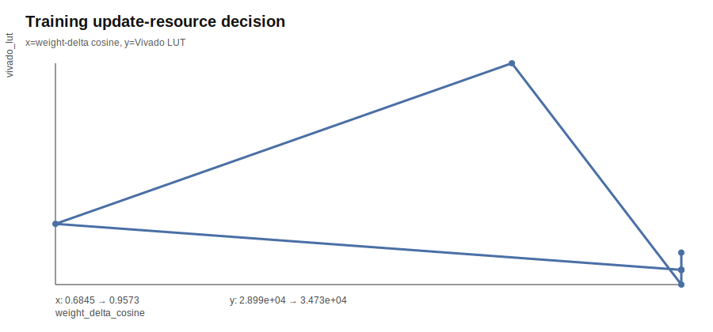
